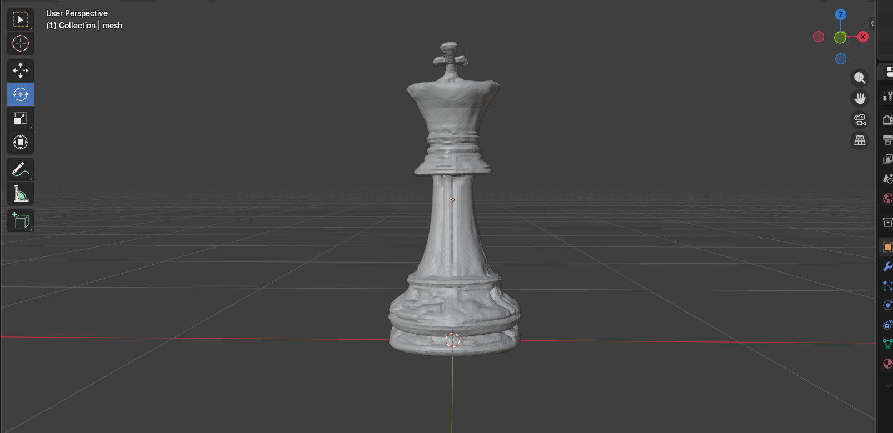

# TripoSR — Windows Local Setup (GTX 1650 / 4GB VRAM)

> **Single image → 3D mesh** running fully offline on a budget GPU. No cloud, no subscription, unlimited generations.

A fully working local Windows installation of [TripoSR](https://github.com/VAST-AI-Research/TripoSR) by Stability AI & Tripo AI — with all dependency conflicts resolved, VRAM optimizations for 4GB cards, and a mcubes CPU fallback patch for systems where `torchmcubes` fails to compile.

---

## 🖼️ Demo

| Input Image | Output Mesh (Blender) |
|---|---|
|  |  |

*Generated locally on GTX 1650 4GB — no cloud, no API*

---

## ⚙️ System Specs This Was Built On

| Component | Spec |
|---|---|
| GPU | NVIDIA GTX 1650 (4GB VRAM) |
| CPU | AMD Ryzen 5 5600H |
| RAM | 16GB |
| OS | Windows 11 |
| Python | 3.11.9 |
| CUDA | 11.8 |

Works on any Windows machine with a 4GB+ NVIDIA GPU.

---

## 🚀 Installation

### Prerequisites
- Python 3.9–3.11
- NVIDIA GPU with CUDA drivers installed
- Git

### Step 1 — Clone this repo
```bash
git clone https://github.com/YOUR_USERNAME/triposr-local-windows.git
cd triposr-local-windows
```

### Step 2 — Create virtual environment
```bash
python -m venv triposr_env
triposr_env\Scripts\activate
```

### Step 3 — Install PyTorch (CUDA 11.8)
```bash
pip install torch==2.1.0+cu118 torchvision==0.16.0+cu118 --index-url https://download.pytorch.org/whl/cu118
```

### Step 4 — Install dependencies
```bash
pip install numpy==1.26.4 --force-reinstall
pip install omegaconf==2.3.0 Pillow==10.1.0 einops==0.7.0 trimesh==4.0.5
pip install imageio==2.33.0 imageio-ffmpeg==0.4.9
pip install huggingface-hub==0.17.3 transformers==4.35.0 tokenizers==0.14.1
pip install safetensors==0.4.0 xatlas==0.0.9 moderngl==5.10.0
pip install scipy==1.11.4 tqdm requests rembg PyMCubes
```

### Step 5 — Apply mcubes patch
`torchmcubes` cannot compile on Windows with modern Visual Studio + CUDA due to a known `cudafe++` incompatibility. This repo includes a CPU fallback patch using `PyMCubes` that replaces it.

Open `tsr/utils/mesh.py` and replace:
```python
from torchmcubes import marching_cubes, sparse_marching_cubes
```
With:
```python
import mcubes as _mcubes
import torch as _torch
import numpy as _np

def marching_cubes(vol, level):
    vol_np = vol.cpu().numpy() if hasattr(vol, 'cpu') else _np.array(vol)
    verts, faces = _mcubes.marching_cubes(vol_np, level)
    return _torch.tensor(verts, dtype=_torch.float32), _torch.tensor(faces.astype(_np.int64), dtype=_torch.long)

def sparse_marching_cubes(vol, level):
    return marching_cubes(vol, level)
```

> Note: Mesh extraction runs on CPU (~2-3 min per object). Model inference still runs on GPU.

---

## 🔧 Usage

### Basic run
```bash
python run.py your_image.png --output-dir output/
```

### Optimized for 4GB VRAM
```bash
python run.py your_image.png --output-dir output/ --chunk-size 200 --mc-resolution 128 --no-remove-bg
```

### High quality output with texture bake
```bash
python run.py your_image.png --output-dir output/ --chunk-size 200 --mc-resolution 256 --bake-texture --texture-resolution 2048
```

### Batch processing
```bash
python run.py img1.png img2.png img3.png --output-dir output/ --chunk-size 200 --no-remove-bg
```

### Local Gradio UI
```bash
python gradio_app.py
```
Then open `http://localhost:7860` in your browser.

---

## 🎛️ Key Parameters

| Flag | Recommended (4GB) | Description |
|---|---|---|
| `--chunk-size` | `200` | Lower = less VRAM, slower. 0 = no chunking (OOM on 4GB) |
| `--mc-resolution` | `128–256` | Mesh density. 256 max before OOM on 4GB |
| `--no-remove-bg` | ✅ use it | Skip background removal (do it manually with remove.bg first) |
| `--bake-texture` | Optional | Bakes UV texture instead of vertex colors |
| `--texture-resolution` | `2048` | Output texture size in pixels |
| `--model-save-format` | `glb` | GLB for Blender/UE5, OBJ for other tools |

---

## 📸 Image Preparation Tips

TripoSR quality is heavily dependent on input image quality.

1. **Remove background first** — use [remove.bg](https://remove.bg) (free)
2. **Center your subject** — object should fill 70–85% of frame
3. **Clean lighting** — flat, even light, no harsh shadows
4. **Best angle** — slight 3/4 view gives better depth than dead-on front
5. **Resolution** — 512×512 to 1024×1024 is the sweet spot

---

## 📦 Output → Blender → UE5 Pipeline

```
Your Image
    ↓
remove.bg (free background removal)
    ↓
python run.py → .obj or .glb
    ↓
Blender (File → Import → glTF 2.0 or Wavefront OBJ)
    → F3 → Smooth by Angle
    → Subdivision Surface modifier (Level 1)
    → Decimate modifier (Ratio 0.5)
    ↓
Export as GLB
    ↓
UE5 Content Browser (drag & drop)
```

---

## 🐛 Troubleshooting

| Error | Fix |
|---|---|
| `CUDA out of memory` | Add `--chunk-size 100 --mc-resolution 64` |
| `torchmcubes` build fails | Apply the mcubes patch in Step 5 |
| `numpy` version conflict | Run `pip install numpy==1.26.4 --force-reinstall` |
| `huggingface-hub` conflicts | Pin to `0.17.3` exactly — newer versions break `transformers==4.35.0` |
| `Pillow` version conflict | Use `Pillow==10.1.0` — newer breaks TripoSR internals |
| Mesh distorted / broken | Pre-remove background before input |
| Texture not loading in Blender | Manually assign PNG in Material Properties |

---

## 📁 Repository Structure

```
triposr-local-windows/
├── tsr/                    # Core TripoSR model code
├── examples/               # Example input images
├── assets/                 # README screenshots
├── run.py                  # CLI inference script
├── gradio_app.py           # Local web UI
├── requirements.txt        # Pinned dependencies (Windows compatible)
├── README.md
└── LICENSE
```

---

## 📋 requirements.txt (Windows-compatible pinned versions)

```
torch==2.1.0+cu118
torchvision==0.16.0+cu118
numpy==1.26.4
omegaconf==2.3.0
Pillow==10.1.0
einops==0.7.0
trimesh==4.0.5
imageio==2.33.0
imageio-ffmpeg==0.4.9
huggingface-hub==0.17.3
transformers==4.35.0
tokenizers==0.14.1
safetensors==0.4.0
xatlas==0.0.9
moderngl==5.10.0
scipy==1.11.4
rembg
PyMCubes
tqdm
requests
```

---

## 🤝 Credits

- **TripoSR** by [Tripo AI](https://www.tripo3d.ai/) & [Stability AI](https://stability.ai/)
- Original paper: [arXiv:2403.02151](https://arxiv.org/abs/2403.02151)
- mcubes fallback patch developed for Windows + VS2022 + CUDA 12.x compatibility

---

## 📄 License

MIT — see [LICENSE](LICENSE)
